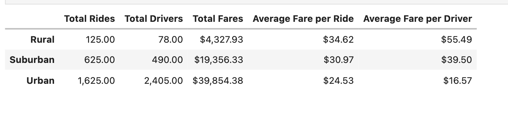
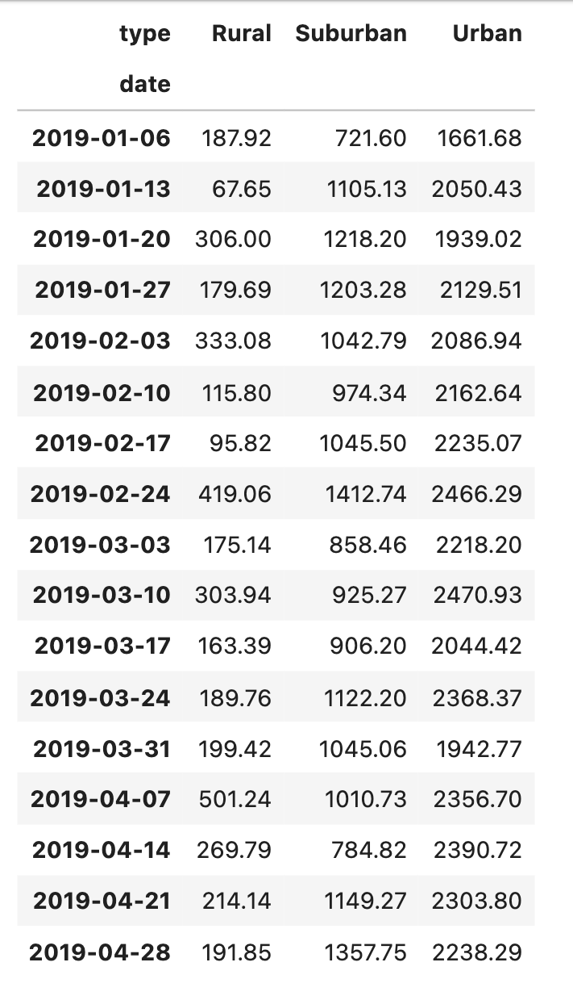
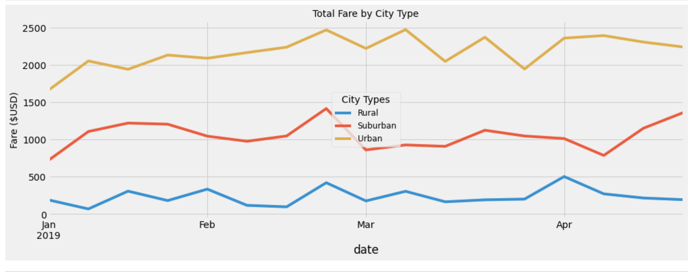

# PyBer_Analysis

>Deliverable 1: A ride-sharing summary DataFrame by city type

>Deliverable 2: A multiple-line chart of total fares for each city type

>Deliverable 3: A written report for the PyBer analysis (README.md)

## Purpose:
To compare and contrast ride-sharing data among the different city types (Urban,Suburban,Rural).

## Overview of the analysis:
>1. To create a summary DataFrame of the ride_sharing data by city type using Python and Pandas.
>2. Using Pandas and Matplotlib create a multiple-line graph that shows the total weekly fares for each city type.
>3. Create a written report for the PyBer analysis that summarizes how the data differes by city type and how those differences can be used by decision_makers at PyBer.

# Results:
### **PyBer_ride_summary_df**

### **Key findings:**

* Rural cities have the highest average fare per driver while urban cities have the lowest.
* Rural cities have the highest average fare per driver while urban cities have the lowest.
* Urban cities have 10 times more total rides than rural cities and 2.6 times more rides than suburban cities.
* Urban cities have 4+ times more drivers than suburban cities and 30 times more drivers than rural cities.
* Urban cities have the highest total fares while rural cities have the lowest.

As shown in the DataFrame riders in rural cities pay on average approximately $10 more for PyBer than riders in urban cities. The average fare per ride is approximately $35 in rural cities whereas the average fare per ride is approximately $25 in urban cities. Suburban cities average fare per ride falls in the middle at approximately $31. Therefore riders pay more for PyBer in rural cities while paying less at urban cities. However, rural city drivers on average make more than urban city drivers.

### **Weekly_sum_fares_df**

Shows the total fare by city type and date:

### **Weekly_sum_fares_df Multiple-Line Graph**

The multiple-line graph "Total Fare by City Type" provides the trend for total fares for each city type (Urban,Suburban,Rural) between the months of January and April 2019. The yellow trend line corresponds to urban cities total fares by month. The orange trend line corresponds to suburban cities total fares by month and the blue trend line corresponds to rural cities total fares by month. Total fare for urban cities do not fall below $1,600 and reach as high as $2500, while suburban cities highest total fare falls below $1,500. Rural cities highest total fare peak is $500 in april 2019.It's important to note the all three type of cities had a spike in total fares at the end of February 2019.

## Summary:
1. The majority of PyBer ridesharing revenue comes from urban cities.This is probably due to the high demand of rides.
2. Drivers is rural cities are earning more than drivers in urban cities.This could be due to the low amount of drivers available in rural cities.
3. The average fare per ride in rural cities cost more than urban and suburban cities.This can be due to the longevity of the ride or distance.
4. Further analysis should be done to determine other factors that are contributing to the high ride costs in rural cities and low driver fares in urban cities.For example, travel distance per ride and time per ride.
